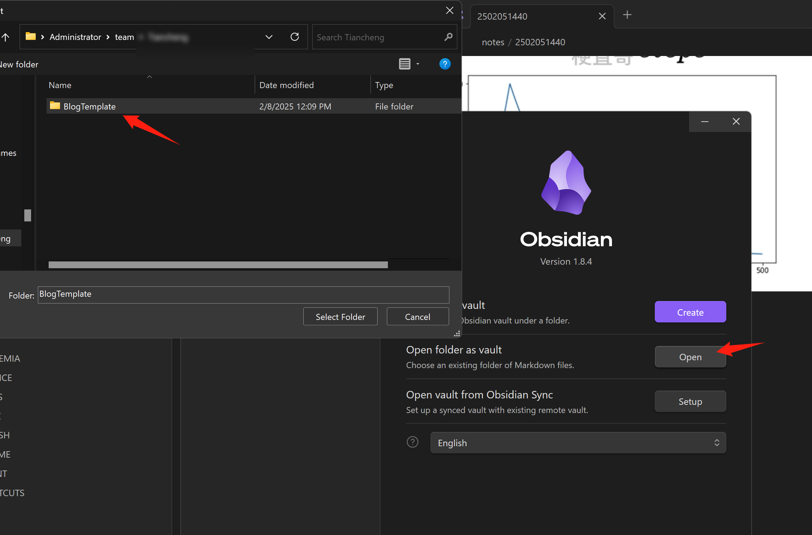
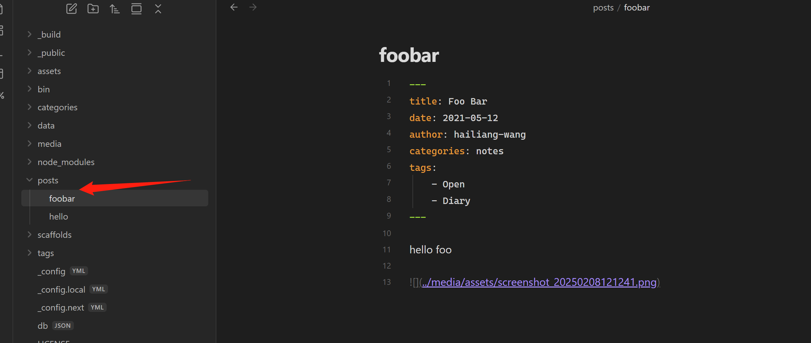

# BlogTemplate

* Host blogs with GitHub
* Write with Obsidian

## Fork and clone

1) Fork github repo: [https://github.com/hailiang-wang/blogtemplate](https://github.com/hailiang-wang/blogtemplate)

2) Clone your own repo.

```
git clone git@github.com:$YOUR_NAME/blogtemplate.git
```

Optional: modify your project name, such as `blogs`, later the project name would be used as part of URL in GitHub Pages Service.

## Add note with Obsidian

> ROOT_DIR, root dir, path cloned for BlogTemplate.

1. Install Obsidian, Git Bash, NodeJS

2. Copy obsidian vault

```
cd $ROOT_DIR
cp -rf assets/_obsidian .obsidian
```

3. Open root dir as vault in Obsidian




Enable all plugins.


4. Add new note in `posts`, e.g. `posts/hello.md`



## Build and serve locally

### Build

Open in Git Bash, cd to $ROOT_DIR

```
cd $ROOT_DIR
npm install 
./bin/build.sh
```


### Serve

```
cd $ROOT_DIR
./bin/dev.sh
```

## FAQs

### How to write in markdown

https://hexo.io/docs/writing

### More config on hexo

https://hexo.io/docs/configuration

### How to publish blogs

After pushed updates into GitHub, GitHub would fire publish jobs with your configurations.

More about GitHub Token, [link](https://docs.github.com/en/actions/security-for-github-actions/security-guides/automatic-token-authentication#using-the-github_token-in-a-workflow).


Turn Workflow job for your repo.


## License

[](http://creativecommons.org/licenses/by/4.0/)

This work is licensed under a [Creative Commons Attribution 4.0 International License](http://creativecommons.org/licenses/by/4.0/).

